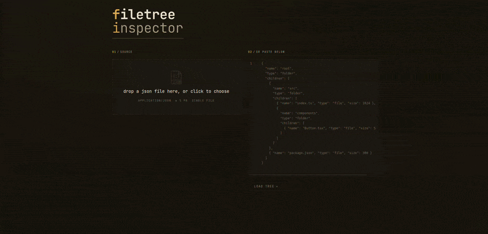

  

<h1 align="center">cloudfide-filetree</h1>

  
  
  
  
  
  
  

  <a href="https://cloudfide-filetree.vercel.app/"><b>LIVE DEMO</b></a>

  

## Decyzje architektoniczne

- **`nuqs` zamiast ręcznego `useSearchParams` + `useDebounce` + 2× `useEffect`**. Zastępuje synchronizację URL ↔ state łamiącą `react-hooks/set-state-in-effect` i powodującą race condition przy nawigacji po kliknięciu w wynik. `throttleMs: 200` (nie debounce) — URL aktualizuje się w trakcie pisania, nie dopiero po pauzie.
- **Stack wydajnościowy wyszukiwania: flat-index + `useDeferredValue` + truncate(200) + throttled URL-write**. Cztery techniki nie wymagające dodatkowych dep's. Świadomie **bez wirtualizacji** — komponent `<TreeNode>` pozostaje prosty i rekurencyjny.
- **Dwa parsery JSON**. `JSON.parse` w `parseInput` (per-keystroke, fail-fast, ~30% szybszy na MB-input); `jsonc-parser` w lincie CodeMirrora (debounced, error-recovery dla nawigacji po wszystkich błędach).
- **CodeMirror**. mam nadzieję, że nieprzekombinowanie :), ale podszedłem do tematu na zasadzie jeśli to ma być "dev tool" to dodam to co sam uważałbym za przydatne.

## Co zostałoby zrobione przy większej ilości czasu

- **Wirtualizacja drzewa i listy wyników** (`react-virtuoso`) dla drzew > ~100 k węzłów — truncate(200) i liniowy filtr mogą przestać wystarczać.
- **Fuzzy search `?fuzzy=1` toggle**. `nuqs` już otwiera drogę: `useQueryState('fuzzy', parseAsBoolean)` plus przełączenie strategii dopasowania w `searchIndex`.
- **Pełniejsze pokrycie testowe na styku komponent ↔ URL** (interakcje z `nuqs`, deep-linki, back-button) — obecnie skupione na pojedynczych komponentach.
- **Historia** załadowanych wcześniej plików.

## Znane ograniczenia

- **Pamięć: O(N) duplikat drzewa.** Flat-index alokuje wpis + `segments: string[]` per descendant. Budowany eagerly przy load drzewa, nawet jeśli użytkownik nigdy nie otworzy wyszukiwania.
- **Wyszukiwanie liniowe O(N) na keystroke.** słabo skaluję się przy dużych plikach/wielu zagnieżdzeniach (100k+).
- **Truncate 200 ukrywa dopasowania.** Cięcie w kolejności DFS, nie po relevance. Banner mówi "first N of M", ale nie informuje, *które* trafienia odpadły.
- **Dwa parsery JSON teoretycznie mogą się rozjechać.** W praktyce oba implementują ten sam JSON-spec; brak znanych rozbieżności.
- **Drift typów `tree.ts` ↔ `schema.ts` asymetryczny.** Dodanie pola tylko do `tree.ts` zostanie złapane przez TS przy `parseInput`; dodanie tylko do `schema.ts` przejdzie niezauważone.
